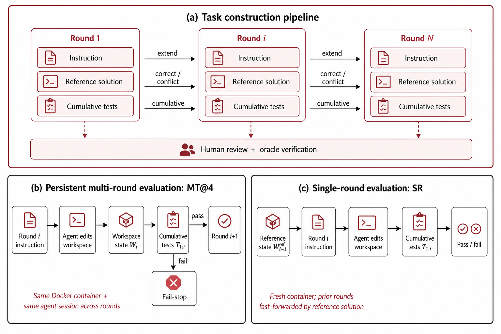
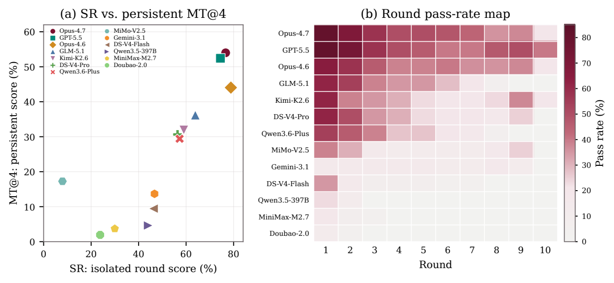
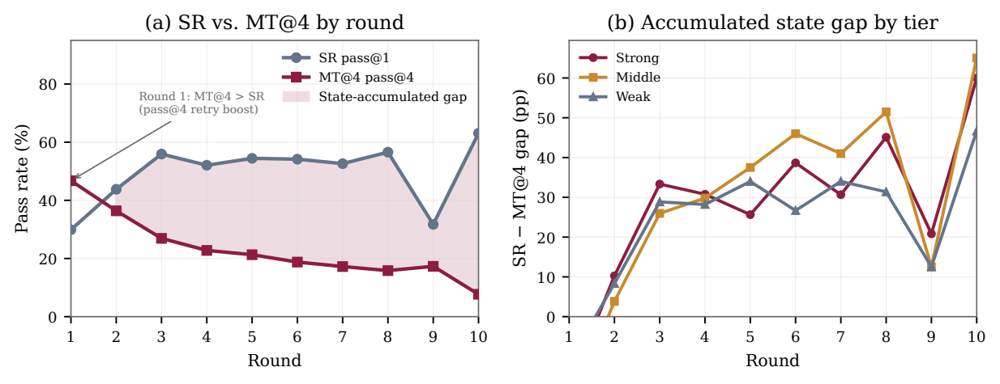

<div align="center">

<h1>
  
  EvoCode-Bench: Evaluating Coding Agents in Multi-Turn Iterative Interactions
</h1>

[](https://huggingface.co/datasets/UnipatAI/EvoCodeBench)
[](https://github.com/UniPat-AI/EvoCodeBench)
[](https://arxiv.org/abs/2605.24110)
[](https://github.com/UniPat-AI/Terminal-X)
[](https://harborframework.com/docs/tasks/multi-step)
[](https://unipat.ai/benchmarks/EvoCode-Bench)

</div>

---

## News

**June 2026.** EvoCode-Bench has **migrated to [Harbor's official multi-step task format](https://harborframework.com/docs/tasks/multi-step)**. It previously ran on our [`harbor_multiturn`](https://github.com/UniPat-AI/harbor_multiturn) evaluation framework; that format and its runner are preserved under [`legacy/`](legacy/) for reproducibility of the paper's original evaluation. On the official format, each task is a sequence of `[[steps]]` run in one persistent container, with a per-step verifier after each step and trial-level reward aggregation.

EvoCode-Bench tests whether coding agents can keep a project working as user requests change. It contains **26 stateful coding tasks** and **227 evaluated rounds** (Harbor *steps*). Each task keeps the same workspace and agent session for **5-15 rounds**, while cumulative executable tests check new requirements and still-active prior requirements.

## Overview

Most coding benchmarks evaluate one specification followed by one final assessment. EvoCode-Bench instead evaluates an interactive coding session. Later rounds inherit earlier implementation decisions, dependencies, file layouts, API choices, and test behavior. Each round (Harbor step) is scored by a cumulative verifier, and the trial reward is the mean of the per-step rewards.

The benchmark is organized along two axes from the paper:

| Engineering activity | Explorative | Contractual | Document-driven | Total |
|:--|--:|--:|--:|--:|
| Construction | 9 / 80 | 3 / 37 | 1 / 7 | 13 / 124 |
| Spec Evolution | 1 / 8 | 1 / 7 | 1 / 7 | 3 / 22 |
| Review | 3 / 21 | 1 / 7 | 1 / 9 | 5 / 37 |
| Migration | 3 / 29 | 1 / 7 | 1 / 8 | 5 / 44 |
| **Total** | **16 / 138** | **6 / 58** | **4 / 31** | **26 / 227** |

Each cell reports **tasks / rounds**. A *round* maps one-to-one to a Harbor *step*.

## Task Format

EvoCode-Bench tasks use the **Harbor official multi-step layout** — one sub-directory per step under `steps/`, executed in the order declared by the `[[steps]]` array in `task.toml`:

```text
task/
├── task.toml                       # metadata + [[steps]] list + reward strategy
├── environment/
│   └── Dockerfile                  # single container shared across all steps
└── steps/
    ├── round-1/
    │   ├── instruction.md          # this round's user request (WHAT, not HOW)
    │   ├── solution/solve.sh        # reference delta for this round
    │   └── tests/test.sh           # cumulative tests through this round
    ├── round-2/
    │   ├── instruction.md
    │   ├── solution/solve.sh
    │   └── tests/test.sh
    └── round-N/ ...
```

`task.toml` follows the official schema (`schema_version = "1.2"`):

```toml
schema_version = "1.2"
multi_step_reward_strategy = "mean"      # trial reward = mean of per-step rewards

[metadata]
name = "service-mesh-health-router"
difficulty = "hard"
category = "systems-networking"

[metadata.requirement_chain]
num_steps = 8

[[metadata.requirement_chain.steps]]
step = "round-1"
change_types = ["extension"]
# ... one entry per step (extension / correction / conflict)

[agent]
timeout_sec = 1800.0                      # global default; override per step via [steps.agent]

[verifier]
timeout_sec = 1800.0                      # global default; override per step via [steps.verifier]

[environment]
build_timeout_sec = 600.0
cpus = 1
memory_mb = 4096
storage_mb = 10240

[[steps]]
name = "round-1"                          # matches steps/round-1/

[[steps]]
name = "round-2"
# ... one [[steps]] entry per step, in execution order
```

The task format is built around three constraints:

- **Persistent workspace**: the same Docker container carries files, dependencies, and generated artifacts across steps.
- **Continuous agent session**: the agent receives a sequence of user requests rather than independent prompts.
- **Cumulative tests**: round `i` verifies every still-active requirement from rounds `1..i`, so regressions are caught immediately. Each step's `tests/test.sh` writes a binary reward to `/logs/verifier/reward.txt`.

## Framework

EvoCode-Bench's standard multi-step evaluation runs on **upstream [Harbor](https://harborframework.com)** — the same framework used by Terminal-Bench 2.0 — using its native multi-step support. No fork is required to run a full task (all steps).

```bash
uv tool install harbor      # or: pip install harbor
harbor run --help
```

Upstream Harbor's official multi-step runner provides:

- native `[[steps]]` sequencing in the order declared in `task.toml`;
- a single persistent Docker workspace shared across all steps;
- a continuous agent session across steps;
- a per-step verifier run against the cumulative test suite after each step;
- trial-level reward aggregation via `multi_step_reward_strategy` (`mean` for EvoCode-Bench).

**Single-Round Fast-Forward (SR)** — solving a target round after fast-forwarding the earlier rounds with reference deltas — is **not yet supported upstream**. It is provided by our Harbor fork [`harbor-official-fast-forward`](https://github.com/UniPat-AI/harbor-official-fast-forward), which adds `--fast-forward-mode oracle-solution` on top of official Harbor. (The legacy [`harbor_multiturn`](legacy/) framework also supports SR.)

| Capability | Upstream Harbor | `harbor-official-fast-forward` (our fork) | legacy `harbor_multiturn` |
|:--|:--:|:--:|:--:|
| Full multi-step run (all steps) | ✓ | ✓ | ✓ |
| Single-round fast-forward (SR) | ✗ (not yet) | ✓ | ✓ |

## Quick Start

### 1. Prerequisites

- **Python 3.11+** (the `evaluation/*.py` helpers use the stdlib `tomllib`).
- **Docker** running, or a remote Daytona target.
- A model endpoint for your agent.

Install the Harbor CLI:

```bash
# uv runs the Harbor CLI. See https://docs.astral.sh/uv/getting-started/installation/
curl -LsSf https://astral.sh/uv/install.sh | sh
uv tool install harbor      # or: pip install harbor
```

`pip install harbor` (upstream) runs full tasks (all steps). Single-Round Fast-Forward (SR) additionally needs our fork — see [Single-Round Fast-Forward](#single-round-fast-forward-sr).

### 2. Prepare Tasks

Download the released EvoCode-Bench task directories from [Hugging Face](https://huggingface.co/datasets/UnipatAI/EvoCodeBench) and place them under `data/EvoCodeBench`. If you already have the Terminal-X repository, the tasks are also available under `Terminal-X/data/EvoCodeBench/`.

### 3. Configure Model Endpoint

For the `claude-code` agent:

```bash
export AGENT_TYPE="claude-code"
export AGENT_MODEL="claude-opus-4-7"
export ANTHROPIC_BASE_URL="https://api.your-provider.com"
export ANTHROPIC_AUTH_TOKEN="sk-..."
```

For the `terminus-2` agent (OpenAI-compatible):

```bash
export AGENT_TYPE="terminus-2"
export AGENT_MODEL="openai/gpt-5.5"
export OPENAI_API_KEY="sk-..."
export OPENAI_API_BASE="https://api.your-provider.com/v1"
```

### 4. Validate the Dataset

```bash
python evaluation/validate_dataset.py data/EvoCodeBench
```

The released benchmark should report **26 tasks** and **227 steps**.

### 5. Run One Task

```bash
# Agent (pass@1 by default; set AGENT_ATTEMPTS for pass@k)
AGENT_TYPE=claude-code AGENT_MODEL=claude-opus-4-7 \
  ./evaluation/run_single.sh data/EvoCodeBench/theme_d1_w1_code_build_greenfield_implementation agent

# Oracle verification (reference solutions; should score 1.0 on every step)
./evaluation/run_single.sh data/EvoCodeBench/theme_d1_w1_code_build_greenfield_implementation oracle

# No-op baseline (empty submission; should score 0)
./evaluation/run_single.sh data/EvoCodeBench/theme_d1_w1_code_build_greenfield_implementation nop
```

### 6. Run All Tasks

```bash
AGENT_TYPE=claude-code AGENT_MODEL=claude-opus-4-7 \
  ./evaluation/run_all.sh data/EvoCodeBench agent
```

Each task writes Harbor outputs under:

```text
data/EvoCodeBench/<task>/harbor_jobs/<model>/
```

## Single-Round Fast-Forward (SR)

The paper reports SR as a complementary metric: the agent solves a target round after Harbor fast-forwards all previous rounds with reference deltas.

> **SR requires our Harbor fork** — upstream Harbor does not yet support `--fast-forward-mode`. Point the runner at [`harbor-official-fast-forward`](https://github.com/UniPat-AI/harbor-official-fast-forward):
>
> ```bash
> git clone git@github.com:UniPat-AI/harbor-official-fast-forward.git
> export HARBOR_BIN="uv --directory $(pwd)/harbor-official-fast-forward run harbor"
> ```

Solve only round 5 from a reference-completed prior state:

```bash
AGENT_MODEL=claude-opus-4-7 \
  ./evaluation/run_single.sh data/EvoCodeBench/theme_d1_w1_code_build_greenfield_implementation \
    agent --start-step 5 --end-step 5
```

Solve rounds 3-7 after fast-forwarding rounds 1-2:

```bash
AGENT_MODEL=claude-opus-4-7 \
  ./evaluation/run_single.sh data/EvoCodeBench/theme_d1_w1_code_build_greenfield_implementation \
    agent --start-step 3 --end-step 7
```

When `--start-step > 1`, the runner adds `--fast-forward-mode oracle-solution` so the earlier steps are prepared with the reference solutions (this flag exists only in the fork).

## Metrics

Each step is scored with a **binary reward** — 1 if all of that step's key requirements pass, 0 otherwise — written by the verifier to `/logs/verifier/reward.txt`. Harbor aggregates a trial's per-step rewards into a trial-level reward via `multi_step_reward_strategy = "mean"`.

The primary score is therefore the **mean per-step reward**:

- **per-task score** = (passed steps) / (total steps) for the trial;
- **dataset score** = mean of per-task scores across the 26 tasks.

For continuity with the paper, `compute_metrics.py` also derives the paper's metrics from the same per-step rewards:

- **MT@4**: `mean_t (1/N_t) sum_i max_{a<=4} r_{t,a,i}` (best-of-4 per round, averaged);
- **SR**: single-round pass rate after reference fast-forwarding earlier rounds;
- **Comp**: fraction of tasks completed through the final round in at least one attempt.

```bash
python evaluation/compute_metrics.py \
  --tasks-dir data/EvoCodeBench \
  --results-dir data/EvoCodeBench \
  --model claude-opus-4-7          # score one agent; add --json for machine-readable output
```

`--model` selects the `harbor_jobs/<model>/` results to score (the `oracle` and `nop` baselines are excluded by default).

## Results

<p align="center">
  
</p>

Paper results (original evaluation; MT@4 / SR / Comp as defined in the paper):

| Agent | MT@4 | SR | Comp |
|:--|--:|--:|--:|
| Claude-Opus-4.7 | 54.0 | 76.7 | 42.3 |
| GPT-5.5 | 52.4 | 74.4 | 38.5 |
| Claude-Opus-4.6 | 44.0 | 78.9 | 34.6 |

SR exceeds MT@4 by 22-40 points for most agents. Isolated round-solving is much easier than keeping the agent's own workspace correct across many rounds.

<p align="center">
  
</p>

## Relation to Terminal-X

EvoCode-Bench is the **iteration** component of [Terminal-X](https://github.com/UniPat-AI/Terminal-X), alongside DeepTerminalBench for single-shot depth and RoadmapBench for version upgrades. Terminal-X contains the combined benchmark suite and cross-dataset blog; this repository focuses on the EvoCode-Bench task format, evaluation protocol, and official-Harbor runner.

## Citation

```bibtex
@misc{shen2026evocodebench,
  title = {EvoCode-Bench: Evaluating Coding Agents in Multi-Turn Iterative Interactions},
  author = {Haiyang Shen and Xuanzhong Chen and Wendong Xu and Yun Ma and Liang Chen and Kuan Li},
  year = {2026},
  eprint = {2605.24110},
  archivePrefix = {arXiv},
  primaryClass = {cs.SE},
  url = {https://arxiv.org/abs/2605.24110}
}
```

## License

Code in this repository is released under the MIT License. Dataset terms follow the dataset release metadata.
